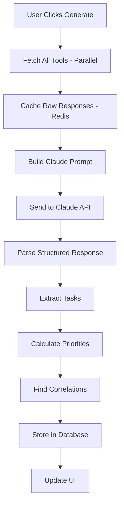

# Product Requirements Document (PRD)
## AI-Powered Work Intelligence Dashboard

### 1. Product Overview

#### 1.1 Vision
Build an intelligent work dashboard that acts as a senior engineer's personal work assistant, automatically synthesizing information from multiple tools (Jira, GitHub, Gmail, Google Calendar) to generate actionable daily tasks and priorities.

#### 1.2 Core Value Proposition
Instead of checking 4+ different tools every morning, engineers get a single, intelligent dashboard that tells them exactly what needs to be done today, why it matters, and in what order.

#### 1.3 Key Differentiator
This is NOT a chat interface or another task manager. It's an intelligent command center that uses Claude AI to understand context, find hidden tasks, and prioritize work that actually matters.

---

### 2. User Personas

#### Primary User: Senior Software Engineer
- **Context**: Technical lead managing backend systems
- **Pain Points**: 
  - Information scattered across multiple tools
  - Missing important tasks buried in comments/emails
  - Difficulty prioritizing across different systems
  - Time wasted context-switching between tools
- **Goals**:
  - Never miss a commitment or blocker
  - Understand daily priorities at a glance
  - Track task completion efficiently

---

### 3. Core Features & User Flows

#### 3.1 Daily Brief Generation

**User Flow:**
1. User clicks "Generate Daily Brief" button
2. System fetches data from all connected tools (parallel)
3. AI processes and synthesizes information
4. Brief appears with structured sections
5. Tasks are automatically extracted and added to todo list

**Display Sections:**
```
Daily Brief - [Date]
├── 🎯 Critical Items (Blocking others/urgent)
├── 📅 Today's Meetings & Required Prep
├── 👀 PR Reviews Needed
├── 📧 Important Emails Requiring Response
├── 🔄 In-Progress Work Status
├── ⚠️ Risks & Blockers
└── 💡 AI Observations (hidden tasks found)
```

#### 3.2 Smart Todo List

**Features:**
- Auto-populated from daily brief
- Manual task addition
- Mark complete with single click
- Shows source (Jira/GitHub/Email/Calendar icon)
- Priority indicator (Critical/High/Medium/Low)
- Related items expansion
- Quick actions (Open in Jira, View PR, etc.)

**Task Card Structure:**
```
[□] Task Title                           [Priority Badge]
    └── Source: Jira BE-123 | GitHub #456
    └── Due: Today 3pm
    └── Blocking: Mobile team
    └── Quick Actions: [Open] [Mark Complete] [Snooze]
```

#### 3.3 Tool Connections Management

**Settings Page:**
- Connect/disconnect tools
- OAuth for Google (Gmail/Calendar)
- PAT tokens for GitHub/Jira
- Connection status indicators
- Test connection buttons
- Last sync timestamps

---

### 4. Technical Architecture

#### 4.1 Tech Stack

**Frontend:**
- Next.js 14 (App Router)
- TypeScript
- Tailwind CSS + shadcn/ui components
- React Query for data fetching
- Zustand for state management

**Backend:**
- Next.js API Routes
- Claude 3 Opus (Anthropic SDK)
- MCP (Model Context Protocol) for tool integration
- PostgreSQL via Supabase
- Redis via Upstash for caching

**Tool Integration:**
- @modelcontextprotocol/sdk
- @anthropic-ai/sdk
- @octokit/rest (GitHub)
- jira-client
- @googleapis/calendar
- @googleapis/gmail

**Infrastructure:**
- Vercel for hosting
- Supabase for database/auth
- Upstash for Redis cache
- Inngest for scheduled jobs

#### 4.2 Database Schema

```sql
-- Core Tables
users (
  id uuid PRIMARY KEY,
  email text UNIQUE,
  created_at timestamp
)

tool_connections (
  id uuid PRIMARY KEY,
  user_id uuid REFERENCES users,
  tool_type text, -- 'jira', 'github', 'gmail', 'calendar'
  credentials jsonb, -- encrypted
  settings jsonb,
  connected_at timestamp
)

daily_briefs (
  id uuid PRIMARY KEY,
  user_id uuid REFERENCES users,
  content jsonb,
  raw_data jsonb, -- cached API responses
  generated_at timestamp
)

tasks (
  id uuid PRIMARY KEY,
  user_id uuid REFERENCES users,
  title text,
  description text,
  source text, -- 'jira', 'github', 'email', 'calendar', 'manual'
  source_id text, -- original ID in source system
  priority integer, -- 1-4
  due_date timestamp,
  completed boolean DEFAULT false,
  completed_at timestamp,
  metadata jsonb, -- source-specific data
  related_items jsonb, -- array of related task IDs
  created_at timestamp
)

task_correlations (
  id uuid PRIMARY KEY,
  task_a_id uuid REFERENCES tasks,
  task_b_id uuid REFERENCES tasks,
  confidence float, -- 0-1
  correlation_type text -- 'explicit', 'temporal', 'semantic'
)
```

#### 4.3 API Endpoints

```typescript
// Brief Generation
POST   /api/brief/generate
GET    /api/brief/latest
GET    /api/brief/:date

// Tasks
GET    /api/tasks?date=2024-01-15
POST   /api/tasks
PATCH  /api/tasks/:id
DELETE /api/tasks/:id
POST   /api/tasks/:id/complete

// Tool Management
GET    /api/tools/status
POST   /api/tools/connect
DELETE /api/tools/:tool/disconnect
POST   /api/tools/:tool/test

// Sync Operations
POST   /api/sync/all
POST   /api/sync/:tool
```

---

### 5. AI Integration Details

#### 5.1 Claude Integration Strategy

**Single-Pass Intelligence:**
```typescript
// Pseudocode for main AI flow
async function generateDailyBrief(userId: string) {
  // 1. Parallel fetch all data
  const [jira, github, gmail, calendar] = await Promise.all([
    fetchJiraTickets(userId),
    fetchGitHubPRs(userId),
    fetchGmailThreads(userId),
    fetchCalendarEvents(userId)
  ]);

  // 2. Single Claude call with all context
  const prompt = buildMasterPrompt({
    jira, github, gmail, calendar,
    userContext: getUserContext(userId),
    currentTime: new Date()
  });

  // 3. Claude returns structured response
  const response = await claude.complete({
    prompt,
    model: 'claude-3-opus',
    maxTokens: 8000,
    temperature: 0.3
  });

  // 4. Parse and store results
  return parseAndStoreTasks(response, userId);
}
```

**Prompt Structure:**
- System context (user role, timezone, preferences)
- Raw data from each tool in structured sections
- Instructions for task extraction and prioritization
- Output format specification (structured JSON)

#### 5.2 MCP Tool Integration

**Tool Registry:**
```typescript
const tools = {
  jira: {
    server: '@modelcontextprotocol/server-jira',
    config: { 
      baseUrl: process.env.JIRA_URL,
      email: user.jiraEmail,
      apiToken: user.jiraToken 
    }
  },
  github: {
    server: '@modelcontextprotocol/server-github',
    config: { token: user.githubToken }
  },
  gmail: {
    server: 'mcp-server-gmail',
    config: { credentials: user.googleCredentials }
  },
  calendar: {
    server: 'mcp-server-google-calendar',
    config: { credentials: user.googleCredentials }
  }
};
```

---

### 6. User Interface Specifications

#### 6.1 Main Dashboard Layout

```
┌─────────────────────────────────────────────────┐
│  [Logo] Work Intelligence  [Generate] [Settings] │
├─────────────────────────────────────────────────┤
│                                                  │
│  Daily Brief                     Todo List      │
│  ┌─────────────────┐  ┌──────────────────────┐ │
│  │                 │  │ □ Review PR #1234     │ │
│  │  Generated:     │  │   High • GitHub       │ │
│  │  9:15 AM       │  │                       │ │
│  │                 │  │ □ Fix BE-789 tests   │ │
│  │  [Brief Content]│  │   Critical • Jira     │ │
│  │                 │  │                       │ │
│  │                 │  │ □ Prep for 3pm meeting│ │
│  │                 │  │   Medium • Calendar   │ │
│  │                 │  │                       │ │
│  │  [Expand All]   │  │ + Add manual task     │ │
│  └─────────────────┘  └──────────────────────┘ │
│                                                  │
│  Tool Status                                     │
│  ● Jira  ● GitHub  ● Gmail  ● Calendar          │
└─────────────────────────────────────────────────┘
```

#### 6.2 Component Hierarchy

```
<Dashboard>
  <Header>
    <Logo />
    <GenerateBriefButton />
    <SettingsButton />
  </Header>
  
  <MainContent>
    <BriefSection>
      <BriefHeader />
      <BriefContent />
      <BriefActions />
    </BriefSection>
    
    <TodoSection>
      <TodoFilters />
      <TodoList>
        <TodoItem />
      </TodoList>
      <AddTaskButton />
    </TodoSection>
  </MainContent>
  
  <StatusBar>
    <ToolStatusIndicator />
  </StatusBar>
</Dashboard>
```

#### 6.3 Key Interactions

**Generate Brief:**
1. Click button → Loading state (spinner)
2. Progress indicators for each tool fetch
3. Stream in results as they process
4. Auto-populate todo list
5. Success notification

**Complete Task:**
1. Check checkbox → Optimistic update
2. Strike-through animation
3. Update in source system (background)
4. Move to completed section

**View Task Details:**
1. Click task → Expand inline
2. Show full context and related items
3. Quick action buttons appear
4. Click outside to collapse

---

### 7. Data Flow & Processing

#### 7.1 Brief Generation Flow



#### 7.2 Caching Strategy

**Cache Layers:**
1. **Tool Response Cache** (Redis, 15 min TTL)
   - Raw API responses from each tool
   - Invalidate on user actions

2. **Brief Cache** (Database, 1 hour)
   - Generated brief content
   - Extracted tasks

3. **Correlation Cache** (Redis, 30 min)
   - Relationships between items
   - Confidence scores

---

### 8. Implementation Phases

#### Phase 1: MVP (Week 1)
- [x] Basic UI structure
- [x] Jira integration via MCP
- [x] GitHub integration via MCP  
- [x] Claude integration
- [x] Generate basic daily brief
- [x] Display as simple task list
- [x] Mark tasks complete

#### Phase 2: Enhanced Intelligence (Week 2)
- [ ] Gmail integration
- [ ] Calendar integration
- [ ] Task correlation system
- [ ] Priority calculation
- [ ] Related items display
- [ ] Caching layer

#### Phase 3: Polish (Week 3)
- [ ] Settings/configuration UI
- [ ] Manual task addition
- [ ] Task filtering/sorting
- [ ] Sync status indicators
- [ ] Error handling
- [ ] Performance optimization

#### Phase 4: Advanced Features (Week 4+)
- [ ] Scheduled brief generation
- [ ] Email notifications
- [ ] Historical view
- [ ] Analytics dashboard
- [ ] Team view (shared tasks)
- [ ] Mobile responsive design

---

### 9. Success Metrics

#### 9.1 Technical Metrics
- Brief generation time < 10 seconds
- Tool sync success rate > 95%
- Cache hit rate > 70%
- Zero data loss on task updates

#### 9.2 User Metrics
- Time saved per day (target: 30 minutes)
- Percentage of tasks completed
- Number of hidden tasks discovered
- User retention (daily active use)

---

### 10. Error Handling & Edge Cases

#### 10.1 Tool Connection Failures
- Graceful degradation (show partial results)
- Clear error messaging
- Retry mechanisms with exponential backoff
- Fallback to cached data

#### 10.2 AI Processing Errors
- Fallback to simple extraction (no AI enhancement)
- Log errors for debugging
- User notification with option to retry

#### 10.3 Rate Limiting
- Queue system for API calls
- Priority-based processing
- User notification for delays
- Cached result usage when limited

---

### 11. Security & Privacy

#### 11.1 Credential Management
- OAuth 2.0 for Google services
- Personal Access Tokens for GitHub/Jira
- Encrypted storage in database
- No credentials in frontend code
- Token refresh mechanisms

#### 11.2 Data Privacy
- User data isolation
- No cross-user data access
- Audit logs for all actions
- GDPR compliance ready
- Data retention policies

---

### 12. Performance Requirements

- **Initial Load**: < 2 seconds
- **Brief Generation**: < 10 seconds
- **Task Update**: < 500ms
- **Tool Sync**: < 5 seconds per tool
- **Concurrent Users**: Support 100+ users
- **Uptime**: 99.9% availability

---

This PRD provides a complete blueprint for building the AI-powered work dashboard. It's structured so you can hand the UI sections to a UI agent and the technical sections to a backend agent, while maintaining consistency across the entire system.